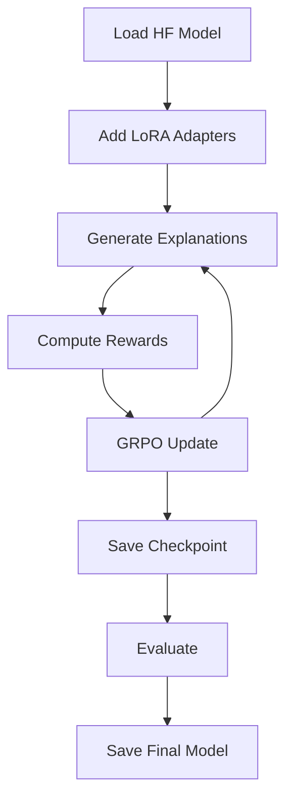

# Hugging Face Model Training with RLT - Complete Guide

## What Was Missing

The original implementation had:
- ✅ Claude API for generating explanations (but not trainable)
- ✅ Reward computation system (rSS and rKL)
- ✅ Data loading pipeline
- ❌ **No trainable teacher model**
- ❌ **No GRPO training algorithm**
- ❌ **No training loop**
- ❌ **No LoRA/PEFT integration**
- ❌ **No model checkpointing**

## What We've Added

### 1. **Trainable HF Teacher Model** (`src/models/hf_teacher_model.py`)
```python
from src.models.hf_teacher_model import HFTeacherModel

# Load any HF model for training
teacher = HFTeacherModel(
    model_name="meta-llama/Llama-3.2-3B-Instruct",
    use_lora=True,
    use_8bit=True  # Memory efficient
)
```

**Features:**
- Support for any HF causal LM model
- Automatic LoRA configuration
- 8-bit quantization support
- Model-specific target modules
- Generation with log probabilities

### 2. **GRPO Training Algorithm** (`src/training/grpo_trainer.py`)
```python
from src.training.grpo_trainer import GRPOTrainer, GRPOConfig

config = GRPOConfig(
    learning_rate=2e-5,
    group_size=4,  # Generate 4 explanations per question
    clip_epsilon=0.2  # PPO-style clipping
)

trainer = GRPOTrainer(teacher, student, reward_fn, config)
```

**Features:**
- Group-based advantage computation
- PPO-style clipped objectives
- Gradient accumulation
- Automatic checkpointing
- Metric tracking

### 3. **Complete Training Script** (`train_rlt_model.py`)
```bash
# Train a model with one command
python train_rlt_model.py \
    --teacher-model "microsoft/phi-2" \
    --datasets gsm8k math \
    --num-epochs 3 \
    --use-lora
```

### 4. **Training Notebook** (`Train_HF_Model_RLT.ipynb`)
- Step-by-step guide
- Custom training pipelines
- Model comparison examples
- Memory optimization tips

## Supported Models

You can now train any Hugging Face causal language model:

| Model | Parameters | Memory (8-bit) | Use Case |
|-------|------------|----------------|----------|
| microsoft/phi-2 | 2.7B | ~3GB | General, efficient |
| meta-llama/Llama-3.2-1B | 1B | ~1.5GB | Fast iteration |
| meta-llama/Llama-3.2-3B | 3B | ~4GB | High quality |
| google/gemma-2b | 2B | ~2.5GB | Open weights |
| EleutherAI/pythia-1.4b | 1.4B | ~2GB | Research |

## Quick Start

### 1. Basic Training
```python
from src.models.hf_teacher_model import HFTeacherModel
from src.training.grpo_trainer import GRPOTrainer, GRPOConfig

# Load model
teacher = HFTeacherModel("microsoft/phi-2", use_lora=True)

# Configure training
config = GRPOConfig(num_epochs=3, batch_size=4)

# Train
trainer = GRPOTrainer(teacher, student, reward_fn, config)
trainer.train(train_dataloader)
```

### 2. Command Line
```bash
# Quick training
python train_rlt_model.py --teacher-model microsoft/phi-2 --max-samples 1000

# Production training
python train_rlt_model.py \
    --teacher-model meta-llama/Llama-3.2-3B-Instruct \
    --datasets gsm8k math arc-c \
    --max-samples 10000 \
    --num-epochs 5 \
    --batch-size 8 \
    --group-size 4
```

## Key Innovations

### 1. **Any Model Support**
Unlike the original Claude-only approach, you can now train:
- Llama models (1B-70B)
- Phi models (1.3B-2.7B)
- GPT models
- Gemma models
- Any AutoModelForCausalLM compatible model

### 2. **Efficient Training**
- **LoRA**: Only train 0.1-1% of parameters
- **8-bit Quantization**: Reduce memory by 50%
- **Gradient Accumulation**: Larger effective batch sizes
- **Mixed Precision**: Faster training with fp16

### 3. **Production Features**
- Automatic checkpointing
- Resume from interruption
- Metric tracking and visualization
- Multi-dataset training
- Configurable everything

## Training Workflow



## Memory Requirements

| Model Size | Full Training | LoRA + 8bit | LoRA + 4bit |
|------------|--------------|-------------|-------------|
| 1B params  | 8GB          | 3GB         | 2GB         |
| 3B params  | 24GB         | 6GB         | 4GB         |
| 7B params  | 56GB         | 14GB        | 8GB         |

## Next Steps

1. **Experiment with Models**: Try different base models
2. **Tune Hyperparameters**: Adjust learning rate, group size
3. **Scale Data**: Use larger datasets for better results
4. **Evaluate Thoroughly**: Test on multiple benchmarks
5. **Deploy**: Use trained models for inference

The system is now complete for training any Hugging Face model with RLT methodology!